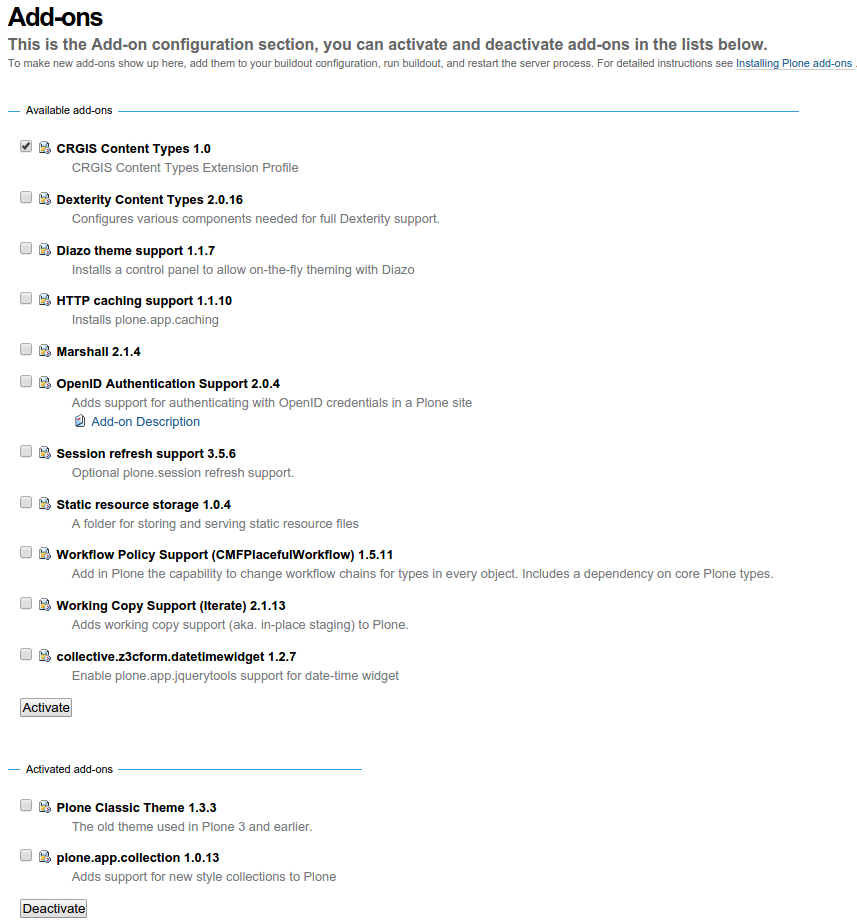

.. contents::

Installation
============

This package is tested with Plone 4.3.2+ environment.
The easiest way is to use Plone 4.3.x UnifiedInstaller to get started.
Add the package name in the eggs section of your ``buildout.cfg``::

    [buildout]

    ...

    eggs =
        ...
        crgis.content
       
And then run "bin/buildout".

Go Site Setup / Add-ons to activate the package.

